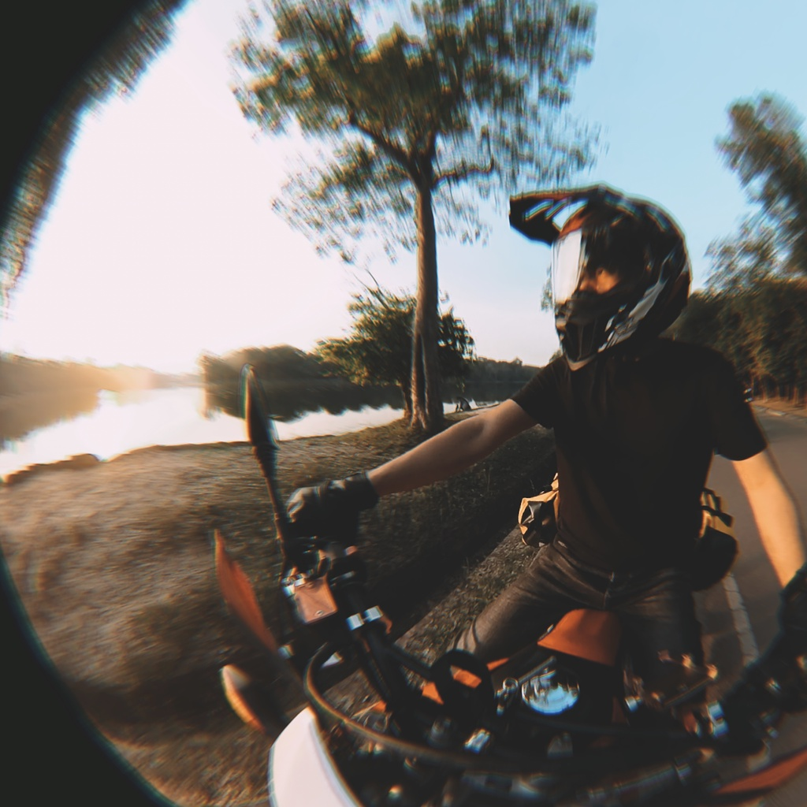

# Moul

Opinionated Image Resizing Library

## Installation

> This package requires a static binary, `https://github.com/moul-co/moul/releases` >= `v5.0.0-rc.5` to be in `$PATH`.

The package can be installed by adding `moul` to your list of dependencies in `mix.exs`:

```elixir
def deps do
  [
    {:moul, "~> 0.4.0"}
  ]
end
```

There are two hashing options available:

- BlurHash [https://github.com/woltapp/blurhash](https://github.com/woltapp/blurhash)
- ThumbHash [https://github.com/evanw/thumbhash](https://github.com/evanw/thumbhash)

By default, `moul` uses ThumbHash, but it can also be configured to use BlurHash.

```elixir
config :moul,
  hash: "blurhash"
```

### Example

<details>
<summary>test/images/DSCF0527.JPG</summary>

```elixir
iex(1)> Moul.moulify("test/images/DSCF0527.JPG")
{:ok,
 %{
   hash: "yygKJQaEeJZ3B4rXhodHqHSHUGcH",
   height: "6240",
   width: "4160"
 }}
```

File created:

- xl: `test/images/DSCF0527/xl.jpeg`
- lg: `test/images/DSCF0527/lg.jpeg`
- md: `test/images/DSCF0527/md.jpeg`
- xs: `test/images/DSCF0527/xs.jpeg`

</details>

<details>

<summary>test/images/profile.png</summary>

```elixir
iex(1)> Moul.avatarize("test/images/profile.png")
{:ok,
 %{
   hash: "GwgSFwKLZYZ/eHZHZ1aWZ4iHyAgpjaAC",
   height: "1190",
   width: "1190"
 }}
```

File created:

- xl: `test/images/profile/xl.jpeg`
- lg: `test/images/profile/lg.jpeg`
- md: `test/images/profile/md.jpeg`
- xs: `test/images/profile/xs.jpeg`

</details>

#### Preview: `xl` | `blurhash` | `thumbhash`

|                                                                            |                                                                                     |                                                                                      |
| -------------------------------------------------------------------------- | ----------------------------------------------------------------------------------- | ------------------------------------------------------------------------------------ |
|  |  |  |
|                       |                       |                       |
|                      |                      |                      |

### Documentation

Documentation can be found here: https://hexdocs.pm/moul
